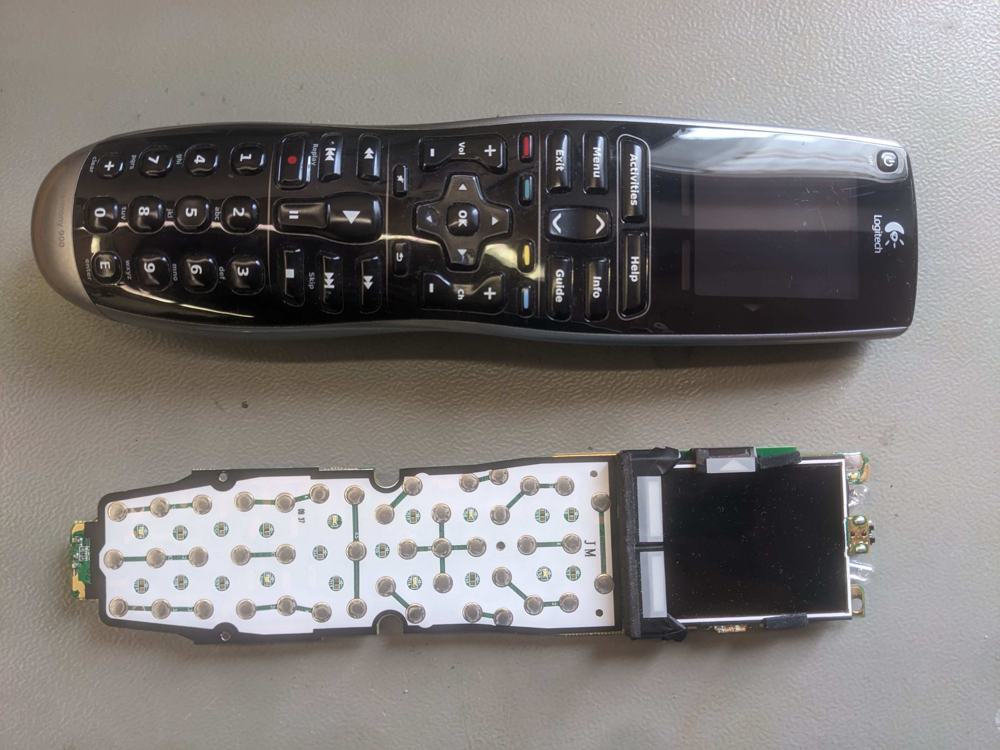
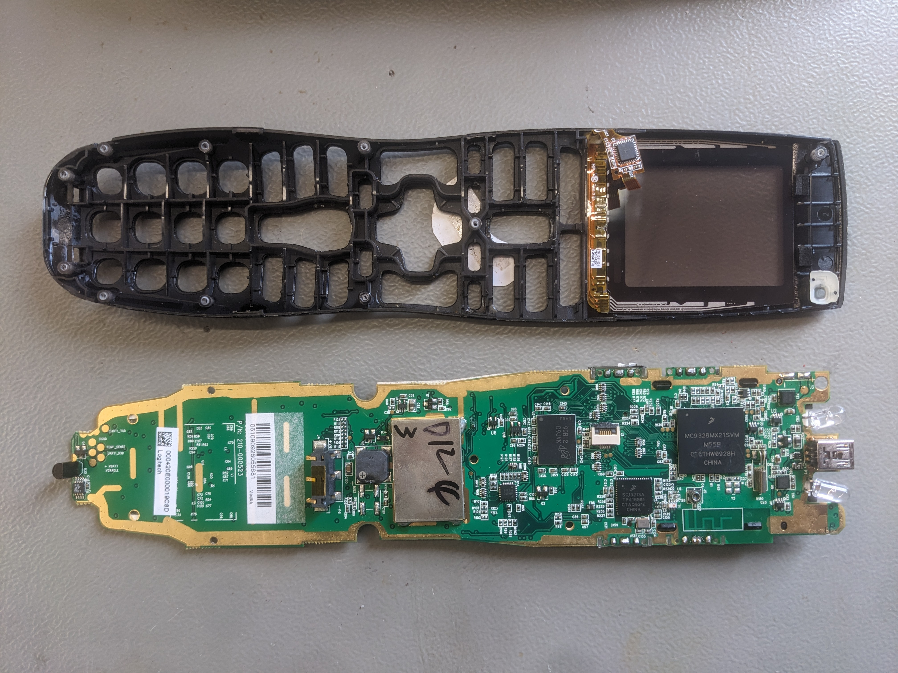

# Harmony 900 universal remote control

## Overview

Everyone who has one today knows why :-).

you can find some stuff here: [Reddit](https://www.reddit.com/r/logitechharmony/comments/1kxacmr/info_theres_hope_for_at_least_harmony_900_if_open/?utm_source=share&utm_medium=web3x&utm_name=web3xcss&utm_term=1&utm_content=share_button)

## System overview

For a 2008/2009 embedded system, this thing is a beast. 

- NXP/Freescale MC9328MX21S arm926 266MHz SoC
- NXP/Freescale SC13213A Zigbee Coprocessor
- 64MByte NVM
- 8MByte RAM
- runs QNX OS v6.3.2
- has a unix shell and file system
- comes with telnet, ftp (server and client), lua interpreter and flash (the Adobe variant, not the memory)
- is detected as USB-to-Ethernet when plugged to a PC.




## USB - Ethernet

The remote implements standard networking. You can use all the nice tools :-)

### Linux

The remote nees some basic USB setup (seems to be optional) and then waits for a dhcp server to assign an ip to it. Automated version:
[Linux setup](../tools/linux-plug-setup/install.md)  

If you can't get this to work you can also have Windows initialise the device. After connecting to windows, just unplug and re-plug in Linux. You can use a VM or physical machine. You then need to run e.g. _ping_ in the background, otherwise the remote de-inits after a few minutes.

### Windows

You need to have the Logitech Harmony software installed to get the driver. This configures the interface ready-for-use.

### General

- you can make a backup of your config using concordance (concordance.exe --dump-config=harmony.hex). You can use this backup to "clone" your remote.
- telnet login is root, password ethanol (yes, really, remote codename is `vodka` btw)
- for the harmony 1000 it is root, password cognac
- it is listening on IP 169.254.1.2
- sloginfo -c -w clears and follows the log (see the qnx docs)
- /fs/etfs/scratch/log.txt also contains a log, just use tail -f /fs/etfs/scratch/log.txt

### Filesystem

The following files are interesting

- your config lives in /usr/data/userconfig
  - ActionLists.xml contains parameters for each IR command
  - UserConfiguration.xml contains your devices and activities
  - IrProto.bin contains raw IR protocol data
  - SsIr.bin contains raw IR data streams
- some more config lives in /usr/data/platformconfig
  - User RF Settings (Harmony RF range extender / zigbee??).
- lua scripts live in /usr/local/share/lua/5.1/ those are unobfurscated and do include comments.

### Fun stuff

Change level of backlight
```
curl --http0.9 http://169.254.1.2/system/backlightlevel --output -
curl --http0.9 -X POST -d "25" http://169.254.1.2/system/backlightlevel --output -
```
### nmap

```
# nmap -Pn 169.254.1.2
Starting Nmap 7.94SVN ( https://nmap.org ) at 2026-04-03 12:43 CEST
Nmap scan report for 169.254.1.2
Host is up (0.0025s latency).
Not shown: 993 closed tcp ports (reset)
PORT     STATE SERVICE
9/tcp    open  discard
21/tcp   open  ftp
23/tcp   open  telnet
80/tcp   open  http
1100/tcp open  mctp
1102/tcp open  adobeserver-1
1600/tcp open  issd
MAC Address: 02:0E:F7:CB:00:00 (Unknown)

Nmap done: 1 IP address (1 host up) scanned in 709.53 seconds

```

port 3074 is missing (IR learning).
